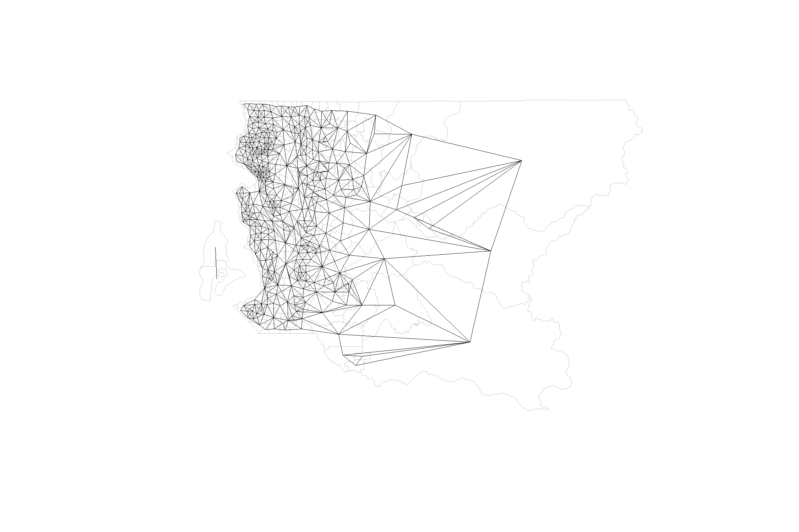

```{r setup, include = FALSE}
knitr::opts_chunk$set(
  collapse = TRUE,
  comment = "",
  root.dir=normalizePath('../'),
  cache = TRUE,
  echo = FALSE,
  message = FALSE,
  warning=FALSE,
  fig.width=7.5,
  fig.height=5
)

library(ggplot2)
library(jsonlite)
library(sp)
```
## Overview

This vignette documents the R package "predictModelTestPkg" that provides a rudimentary space-time logistic regression model fit to very fake data. The documentation and API will get better over time.  First, I describe the API calling the trained model at our URL.  After that, I'll go into the raw data that went into the mapping model, the model, and its inputs and outputs. 

## The API

A cached model that was trained to (very) fake data described below is currently hosted at [http://40.112.165.255/flu](http://40.112.165.255/flu).    Example POST queries are shown in [example_request.md](https://github.com/InstituteforDiseaseModeling/Seattle-Flu-Incidence-Mapper/blob/master/example_request.md)

### Input

Model queries need to be sent via JSON.  Right now, there are only two valid JSON requests--one for the fitted model and one for the data.

**Request fitted model**
```{r incidencQuery}
toJSON(fromJSON('{
  "output": ["incidence"],
  "attributes": ["Census_Tract", "vax_status"],
  "basis": ["year"],
  "values": ["incidence_median", "incidence_sd"]
}'),pretty=TRUE) 
```
This query will return a JSON object with the model estimates of the incidence of flu in ILI broken down by *Census_Tract* (11 digit GEOID) and *vax_status* (0 = not vaccinated this year, 1 == vaccinated this year), with data points as the tuple *year, incidence_median, incidence_sd*.   This is the default returned if no query is sent. 

**Request raw data**
```{r rawDataQuery}
toJSON(fromJSON('{
  "output": ["observed"],
  "attributes": ["Census_Tract", "vax_status"],
  "basis": ["year"],
  "values": ["flu_count", "nsamples"]
}'),pretty=TRUE)
```
This query will return a JSON object with the model estimates of the oberved counts of flu positives in ILI broken down by *Census_Tract* (11 digit GEOID) and *vax_status* (0 = not vaccinated this year, 1 == vaccinated this year), with data points as the tuple *year, flu_count, nsamples*.   This is the default returned if no query is sent. 

**Query schema (embryonic)** 

(Better schema and documentation to come!)

The categories of *output* can be *observed* or *incidence*. (Obvious improvements would be *data* and *model*...). 

The *attributes* describe the requested data groupings.  Currently allowed value is only both *["Census_Tract", "vax_status"]*. (Independence and more options is coming.)

The *basis* describes the "x-axis variable."  Right now, only *year* is available (decimal year, each data point is one week apart in this version, but that is subject to change), but *age* will be another.  Those are the two obvious bases for these models, but we may want more. 

The *values* describe the output data requested.  Right now, the only valid query for *output:incidence* is *"values": ["incidence_median", "incidence_sd"]*.  And for *output:observed*, only *"values": ["flu_count", "nsamples"]*.  (Harmonized variables and independence are coming.)

Right now, there is no way to filter by census tract, date range, or other factors, but that will change soon too.  

### Output
The server will return the output as JSON containing the query and the data.

For example, if you request the *incidence* JSON above, you will get back
```{r output}
toJSON(fromJSON('{
  "output": ["incidence"],
  "attributes": ["Census_Tract", "vax_status"],
  "basis": ["year"],
  "values": ["incidence_median", "incidence_sd"],
  "data" : [
    { "Census_Tract": 53003960100, 
      "vax_status": 0,
      "data": [
        {"year": 2018.8462, "incidence_median": 0.0031, "incidence_sd": 0.211},
        {"year": 2018.8654, "incidence_median": 0.0055, "incidence_sd": 0.1815}, 
        {"year": 2018.8846, "incidence_median": 0.012, "incidence_sd": 0.164},
        {"...": "..."}
      ]
    },
    { "Census_Tract": 53005010400, 
      "vax_status": 0, 
      "data": [
        {"year": 2018.8462, "incidence_median": 0.0212, "incidence_sd": 0.2186},
        {"...": "..."}
      ]
    }
  ]                                                     
}'),pretty=TRUE)
```

Unlike the input query schema, I think this is closer to the real format we'll have.  R is inherently row-based, and so it's natural to have each point as it's own tuple instead of an array like {"year" : [2018.8462, 2018.8654, ...]}.  If you really want arrays, I'm sure we can coerce it in the R or python outer layer, but it may add to latency. 


## King County map
Here's a map of census tracts in King County, WA.  This defines the domain of the simulated data and subseqent analysis.  Overlaid is the nearest-neighbor connectivity graph used for spatial smoothing (this version doesn't link Vashon Island to the mainland, but this will change).

```{r map, results='hide'}
kcShapes <- sf::st_read(paste(knitr::opts_chunk$get('root.dir'),"inst/extdata/censusData","cb_2017_53_tract_500k.shp",sep="/"))
kcShapes <- kcShapes[kcShapes$COUNTYFP=='033',]
kcShapes$rowID<-1:nrow(kcShapes)
kcShapes$Census_Tract <- as.numeric(levels(kcShapes$GEOID))[kcShapes$GEOID]

kcNeighborGraph <- INLA::inla.read.graph(filename = paste(knitr::opts_chunk$get('root.dir'),"inst/extdata/censusData","kc.adj",sep="/"))

# plot(sf::st_geometry(kcShapes), border="grey", lwd=0.1)
# plot(kcNeighborGraph, sp::coordinates(as(kcShapes,"Spatial")), points=FALSE, add=TRUE, lwd=0.5)
```
```{r mapshow, out.width = '100%'}

```

## Simulated Truth
```{r data}
linelist <- read.csv(paste(knitr::opts_chunk$get('root.dir'),"inst/extdata","infection_individuals_0.01nonflu.csv",sep="/"))
# linelist <- read.csv(paste("inst/extdata","infection_individuals_0.01nonflu.csv",sep="/"))

simulatedData <- read.csv(paste(knitr::opts_chunk$get('root.dir'),"inst/extdata","simulatedInfluenzaByTract.csv",sep="/"))
simulatedData<-simulatedData[!is.na(simulatedData$year),]
# simulatedData <- read.csv(system.file("extdata","simulatedInfluenzaByTract.csv",package = "predictModelTestPkg"))
```

We simulated an influenza outbreak on top of non-flu ILI. A time series of the true number of cases is shown below.

```{r truthTimeseries, fig.show='hold'}
ggplot(linelist, aes(x=year)) + geom_histogram(breaks = unique(simulatedData$year)) + facet_wrap(.~Diagnosis)
```

For influenza, we simulated a 3-stage outbreak with a very large spatial signal to develop models against.  The map is broken into three blocks, with an independent outbreak in Seattle, Shoreline, Kenmore, and Lake Forest Park, another fast one on the eastside north of I-90, and a third in the rest of the county.  

```{r truthCount, fig.show='hold', fig.height=18}
t<-dplyr::right_join(simulatedData,kcShapes)
  
ggplot()  + geom_sf(data=t[ t$vax_status==0,],aes(fill = flu_count), size=0, inherit.aes = FALSE)  + 
    facet_wrap(.~year, ncol = 3) +
    theme_bw() + theme(axis.text=element_blank(),axis.ticks=element_blank()) +
    viridis::scale_fill_viridis(trans='log', breaks=c(1,5,10,20,50,100), name="flu cases", na.value="transparent") +
    xlab('')+ylab('') +
    xlim(c(-122.5, -121.7)) + ylim(c(47.15,47.77))
```

The figure above shows the total count of flu cases by census tracts for people who haven't been vaccinated for flu in the last year.  Each infected individual was assigned an address from the King County address registry, and then those were mapped to their census tracts.  Census tracts are roughly equal-population units, and so the count is representative of the true prevalence. (In the future, I will pull in the census denominators.)  

For the sake of modeling, we assume recent flu vaccination has no impact on non-flu ILI, but lowers the probability of ILI being flu by 

The figure below shows the prevalence of flu in ILI -- the truth behind what we actually observe with ILI surveillance.  You see that the spatial pattern of flu is similar but the variable now ranges from 0 to 1. 

```{r truthPrevalence, fig.show='hold', fig.height=18}
ggplot()  + geom_sf(data=t[ t$vax_status==0,],aes(fill = flu_count/nsamples), size=0, inherit.aes = FALSE)  + 
    facet_wrap(.~year, ncol = 3) +
    theme_bw() + theme(axis.text=element_blank(),axis.ticks=element_blank()) +
    viridis::scale_fill_viridis(breaks=seq(0.1,0.9, by=0.4), name="flu in ILI", na.value="transparent") +
    xlab('')+ylab('') +
    xlim(c(-122.5, -121.7)) + ylim(c(47.15,47.77))
```

## Observed data
In the real world, we don't get to see every ILI.  The figure below shows the observed prevalence of flu in ILI among 10,000 randomly chosen cases.  This is what goes into training the geospatial model.

```{r observedPrevalence, fig.show='hold', fig.height=18}
observedData <- read.csv(paste(knitr::opts_chunk$get('root.dir'),"inst/extdata","observedInfluenzaByTract.csv",sep="/"))
observedData<-observedData[!is.na(observedData$year),]
# observedData <- read.csv(system.file("extdata","observedInfluenzaByTract.csv",package = "predictModelTestPkg"))

t<-dplyr::right_join(observedData,kcShapes)
  
ggplot()  + geom_sf(data=t[ t$vax_status==0,],aes(fill = flu_count/nsamples), size=0, inherit.aes = FALSE)  + 
    facet_wrap(.~year, ncol = 3) +
    theme_bw() + theme(axis.text=element_blank(),axis.ticks=element_blank()) +
    viridis::scale_fill_viridis(breaks=seq(0.1,0.9, by=0.4), name="flu in ILI", na.value="transparent") +
    xlab('')+ylab('') +
    xlim(c(-122.5, -121.7)) + ylim(c(47.15,47.77))
```


## INLA Geospatial regression model

Explain model!

## Model output

We use the model to fill in the map. The figure below shows the median estimated prevalence of flu in ILI given the model and the observations. 

```{r predictedPrevalence, fig.show='hold', fig.height=18}
predictedData <- read.csv(paste(knitr::opts_chunk$get('root.dir'),"inst/extdata","predictedInfluenzaByTract.csv",sep="/"))
# predictedData <- read.csv(system.file("extdata","predictedInfluenzaByTract.csv",package = "predictModelTestPkg"))

t<-dplyr::right_join(predictedData,kcShapes)
t<-t[!is.na(t$year),]

ggplot()  + geom_sf(data=t[ t$vax_status==0,],aes(fill = incidence_median), size=0, inherit.aes = FALSE)  + 
    facet_wrap(.~year, ncol = 3) +
    theme_bw() + theme(axis.text=element_blank(),axis.ticks=element_blank()) +
    viridis::scale_fill_viridis(breaks=seq(0.1,0.9, by=0.4), name="flu in ILI", na.value="transparent") +
    xlab('')+ylab('') +
    xlim(c(-122.5, -121.7)) + ylim(c(47.15,47.77))
```

The figure below shows the timeseries prevalence estimates for a few census tracts.
```{r predictedTimeseries, fig.show='hold'}
t<-dplyr::left_join(t,observedData,by=c('Census_Tract','vax_status','year'))

t<-t[!is.na(t$year),]

tmp<-dplyr::filter(t,Census_Tract %in% unique(t$Census_Tract)[c(2,20,100,240)])
  
ggplot(tmp,aes(x=year,y=flu_count/nsamples,group=vax_status, color=as.factor(vax_status))) +
    geom_point() + facet_wrap(.~Census_Tract) +
    geom_line(aes(year,incidence_median)) +
    geom_ribbon(aes(x=year,ymin=incidence_lower95,ymax=incidence_upper95,fill=as.factor(vax_status)),alpha=0.3,color=NA) +
    guides(color = guide_legend(title = "vax status"),fill=FALSE)

```


A feature of the current model that isn't great is the amount of variance required to fit a rapid time trend is the same as the future variance of the forecasts.  Hence the forecast uncertainty gets bad fast.  With a more realistic (much less exaggerated spatial pattern), this problem will be smaller.  But I think this is part of why people in forecasting are moving toward combining flexible statistical models with simple dynamical models.  By using the predictions of a calibrated dynamical model as a covariate, you can explain a lot of the time signal, and then the stats model only has to adjust relative to that, as opposed to fitting the whole thing...
